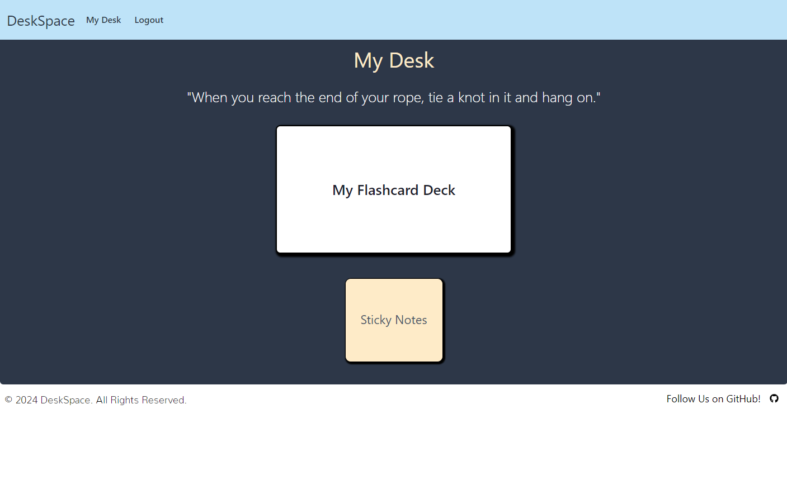
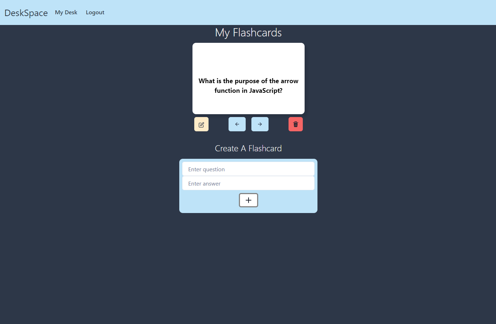
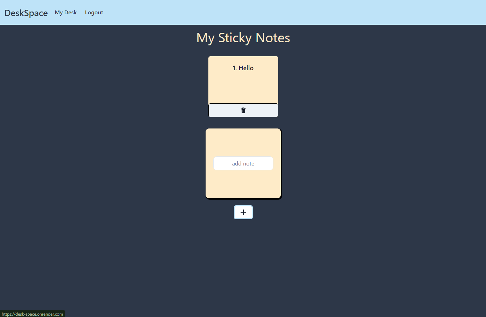

# Desk Space

## Table of Contents

* [Description](#description)
* [Installation](#installation)
* [Usage](#usage)
* [Credits](#credits)
* [Screenshots](#screenshots)
* [Video](#video)
* [Link to Website](#link-to-website)
* [License](#license)

## Description

This application is Desk Space. Desk Space is an application that allows the user to prepare for job interviews and assist with a finding a job. The user can utilize My Desk to study with personalized flash cards. The user can also utlize Sticky Notes to save job links and notes to assist with their job search. The user will also be inspired in their job search by Inspirational Quotes that will be visible on the My Desk screen.

## Installation

The user can access this application by clicking on the link below. In order to install this application locally the user will need to download the code from this resository. The user will need to ensure that the latest versions of Node.js, MongoDB and a code editor such as VSCode are installed on their computer to fully utilize this application. After the code is downloaded, the user will need to enter the following command in the CLI: `npm i` while in the root directory. Next, the `npm run develop` command will start the client server at http://localhost:5173 and GraphQL at http://localhost:3001/graphql.

## Usage

In order to fully utilize this application, the user will need to Sign Up. Once the user completes the Sign Up process, they will need to ensure they are Signed In and My Desk and Sticky Notes will be available. The user can save Sticky Notes to be available for later use. The user can also generate their own personalized flashcards, delete them, and edit them which will all be saved for future use.

## Credits

This project was done in collaboration among coding students Christina Carroll, Martin "Gabe" Harvey, Shane Lee Johnson, and Kalyn Sifuentes.

## Screenshots

Main Screenshot:

MyDesk Screenshot:

Flashcard Screenshot:

Sticky Notes Screenshot:

## Video

N/A

## Link to Website

https://desk-space.onrender.com/

## License

This application is licensed under The MIT License.

https://opensource.org/licenses/MIT